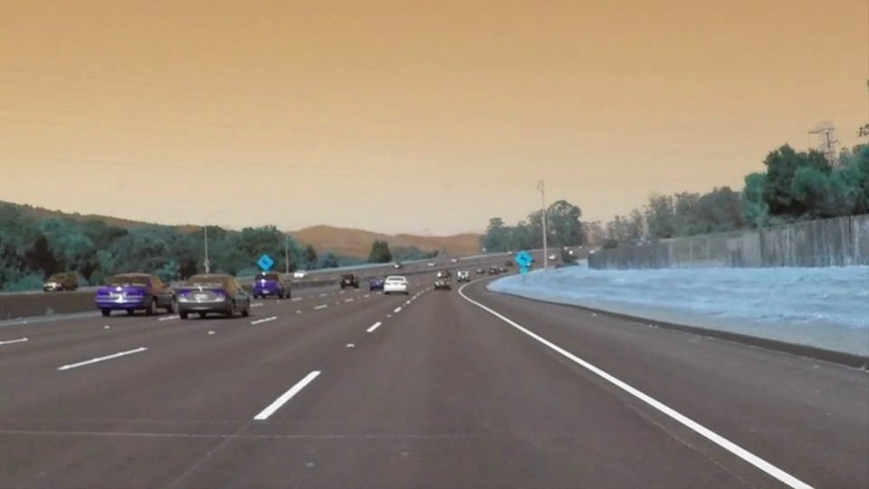

# **Finding Lane Lines on the Road** 

## Writeup Template

### You can use this file as a template for your writeup if you want to submit it as a markdown file. But feel free to use some other method and submit a pdf if you prefer.

---

**Finding Lane Lines on the Road**

The goals / steps of this project are the following:
* Make a pipeline that finds lane lines on the road
* Reflect on your work in a written report

[//]: # (Image References)

[image1]: ./examples/grayscale.jpg "Grayscale"

---

### Reflection

### 1. Describe your pipeline. As part of the description, explain how you modified the draw_lines() function.
<h3>Actual Image</h3>

<h3>Stage 1 : Convert Image to GrayScale image</h3>

First image is converted to gray scale image

<h3>Stage 2 : Gaussian Blur </h3>

Before applying Canny Edge detection, Gaussian Blur is applied to it to smooth out the image, so as to avoid spikes when Canny Edge Detection Algorithm is applied

<h3>Stage 3 : Canny Edge Detection</h3>

Canny Edge Detection helps in identifying edges in the image

<h3>Stage 4 : Extract ROI</h3>

A polygon in the form of trapezium is created to extract the region in front of the ego vehicle

<h3>Stage 5 : Hough Transform</h3>

Hough transform is carried out over the ROI obtained in stage 4
Also in this step, the line segments are divided into two groups using their slopes.
The line segments whose slope is negative belong to the left lane marking and with positive slope belong to the right lane marking.
Vertices belonging to the left and right lane marking are then used to obtain the line that best fits these vertices.
I have used RANSAC(Random Sample Consensus). In this algorithm, several iterations are performed on the group of vertices.
In each iteration two random vertices are selected and then the equation of line is obtained passing through these two points. 
Then the sum of distance of all the vertices from this line is obtained. The line with the least distance sum gives the best fitted line.

<h3>Stage 6: Resultant Image</h3>

Resultant image is obtained by superimposing the lane marking obtained in the stage 5 with the actual image

### 2. Identify potential shortcomings with your current pipeline
- sometimes the lane markings are curved and in that case it would be difficult to fit a straight line through the edges
- this method also becomes less accurate when the gaps in lane markings are large

### 3. Suggest possible improvements to your pipeline
- for finding the curved lane marking you need to fit a spline vs a straight line